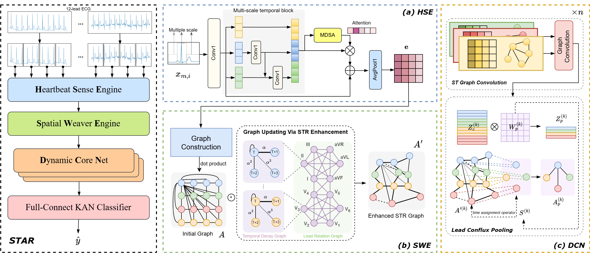
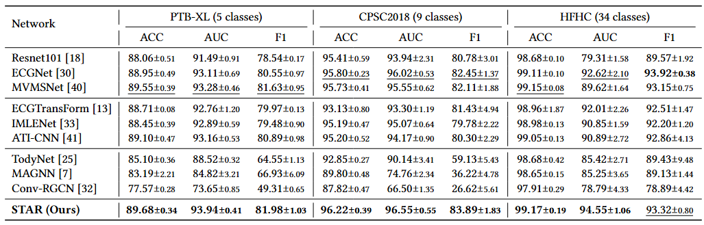

# Spatial-Temporal-ECG
The code for paper "STAR: A Spatio-Temporal Dynamic Graph Learning Framework for Automated ECG Classification"
# Requirements
In order to run this project, you need to install the following packages:
* pytorch 1.12
* python 3.8.10
* numpy 1.24.4

# :partying_face:Abstract
The 12-lead electrocardiogram (ECG) is a crucial tool for diagnosing cardiovascular diseases. Traditional ECG-based automated diagnostic methods typically capture spatial and temporal dependencies separately. However, due to the complex spatial-temporal relationships in 12-lead ECGs, they often overlook fine-grained correlations across different leads at various timestamps, which could be enhanced using external knowledge. This limitation hinders the representation of patient-specific information. In this work, we address these challenges using a Spatial-Temporal Dynamic Graph (STAR). STAR models each patient’s ECG as a dynamic Spatial-Temporal Relationship (STR) graph, effectively capturing spatial-temporal dependencies and patient-specific features by integrating ECG data with latent spatial-temporal knowledge. Our method incorporates a patch-wise multi-scale temporal feature extraction module to enhance fine-grained temporal representation. To further capture the comprehensive spatial-temporal dependencies in the STR graph, a dynamic graph learning module with a lead-specific pooling method is proposed. Experiments demonstrate that our approach outperforms state-of-the-art methods across multiple tasks on several multi-label datasets.


# :triangular_flag_on_post:Dataset
We use three dataset for our experiments:
## :ballot_box_with_check:PTB-XL
You can download the dataset at this [link](https://physionet.org/content/ptb-xl/1.0.3/)<br>
The PTB-XL ECG dataset contains 21,837 10-second clinical 12-lead electrocardiograms from 18,885 patients. The dataset contained 52% of men and 48% of women, covering the age range 0-95 years. In the annotation file, there are 71 SCP-ECG statements for ECG annotation, which can be divided into three categories: diagnostic statements, formal statements, and rhythm statements. Based on diagnostic statements, the PTB-XL dataset provides five coarse superclasses (NORM, CD, MI, HYP and STTC). In this study, five coarse superclasses were selected for multi-label ECG classification experiments. 
## :ballot_box_with_check:CPCS2018
You can download the dataset at this [link](http://2018.icbeb.org/Challenge.html)<br>
The multi-label dataset, derived from the China Physiological Signaling Challenge 2018 (CPSC 2018), contained 6,877 12-lead electrocardiogram recordings ranging in time from 6 to 60 seconds. The dataset has 9 classes with a sampling frequency of 500hz, and we downsample the data to 100hz when using it. Due to inconsistent data length, we sampled all data to 10s; KFold was used to divide the data into 10 groups, and 10-fold cross-validation was used for the experiment.
## :ballot_box_with_check:HFHC
You can download the dataset at this [link](https://tianchi.aliyun.com/competition/entrance/231754/information)<br>
Hefei High-Tech Cup (HFHC) Dataset contains 20335 medical ECG samples and was provided by the Engineering Research Center of the Ministry of Education of the Mobile Health Management System of Hangzhou Normal University. The dataset has 34 classes. Each sample has eight leads: I, II, V1, V2, V3, V4, V5, and V6. The data for the remaining 4 leads can be calculated from the data for the first 8 leads. The sampling frequency of each data point is 500hz and the sampling time is 10 seconds. We also reduced the sampling frequency of the data to 100hz, and then normalized the data. 10-fold cross-validation was also used for the dataset.

# :exclamation:Experimental Results

# :question:How to use
## :pencil2:Data Preprocessing
In order to use a data set, you need to process the data set first.
For CPCS2018 dataset, you should firstly run `utils/convert_cpcs.py` to generate `cpsc_database.csv`<br>
Then you can run `utils/dataset.py` and generate the npy file
```python 
python utils/dataset.py
```
## :page_with_curl:Modify parameter file
You need to change the parameter file to your own configuration, including `dataset`, `save_path`, `n_class`, etc
## :arrow_forward:Run code 
For the PTB-XL data set and CPCS2018 data set, you only need to run the `main.py` file, for the HFHC data set, you need to run the `main_HFHC.py` file
```python 
python main.py
```
# Acknowledgement
Thanks to [code](https://github.com/ysxGitHub/MVMS-net/tree/main) for providing reference for our data preprocessing

